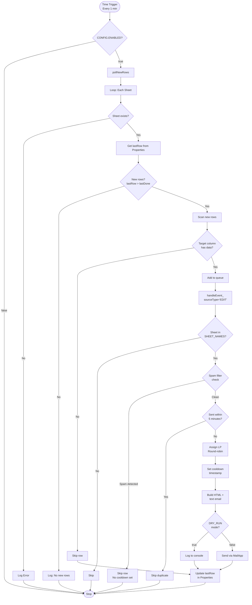
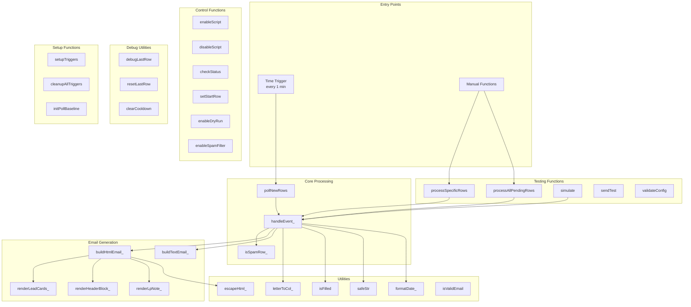
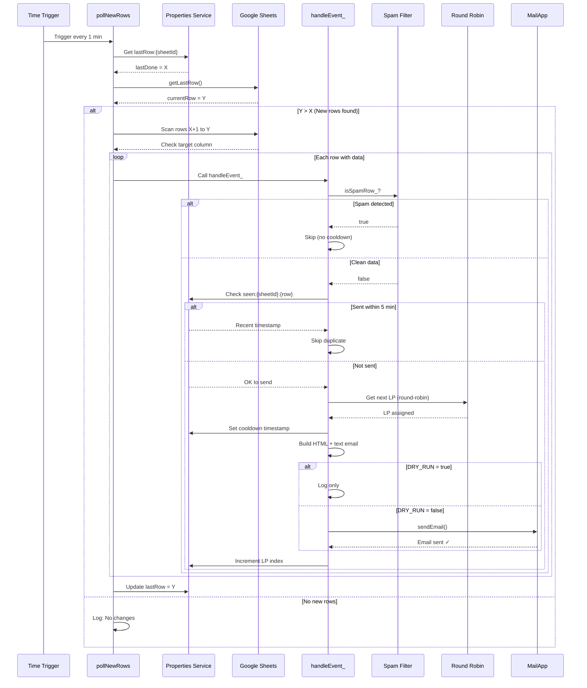
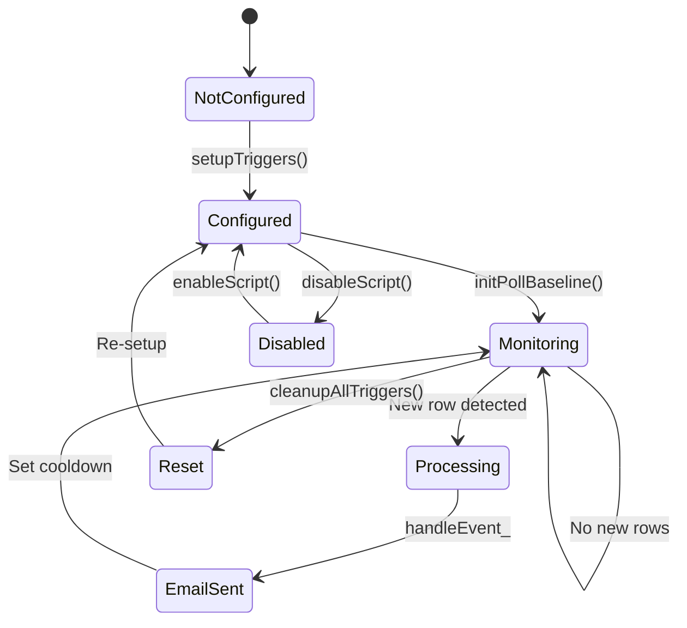

# Round Robin Lead Notifier - Complete Workflow Documentation

## 📋 System Overview

**Purpose**: Automated lead distribution system that monitors Google Sheets for new leads and sends email notifications using a round-robin mechanism.

**Trigger Mechanism**: Time-driven polling (every 1 minute)

**Target Sheets**: Configurable via `CONFIG.SHEET_NAMES`

**Core Function**: Distribute leads fairly across a pool of recipients using round-robin algorithm

---

## 🎯 Key Features

### ✅ Core Features
1. **Time-based Polling** - Automatic detection of new rows every 1 minute
2. **Round-Robin Distribution** - Fair lead assignment across recipient pool
3. **Multi-sheet Support** - Monitor multiple sheets simultaneously
4. **Duplicate Prevention** - 5-minute cooldown to prevent re-sending
5. **Spam Filter** - Filter out test/invalid leads using keyword detection
6. **Batch Protection** - Prevent mass email sending from bulk imports
7. **Dry Run Mode** - Test without sending real emails
8. **Thread-safe Processing** - Lock mechanism for concurrent execution
9. **Comprehensive Logging** - Detailed console logs with emoji indicators
10. **Email Notifications** - HTML + plain text format with responsive design

### 🆕 Advanced Features
1. **Quick Control Functions** - Enable/disable script, set start row, check status
2. **Manual Testing Tools** - Process specific rows, simulate processing
3. **Configuration Validator** - Verify setup before going live
4. **Debug Utilities** - Track last processed row, clear cooldowns
5. **Error Notifications** - Auto-send error alerts to admins
6. **Cleanup Tools** - Remove unwanted triggers
7. **PII Data Collection** - Capture Name, Phone, Email, DoB, Leadcode, Intention

---

## 🔧 Configuration

### CONFIG Object Structure

```javascript
CONFIG = {
  // Master Controls
  ENABLED: true,                    // Master on/off switch
  START_FROM_ROW: null,             // null = auto, or specific row number
  BATCH_PROTECTION: true,           // Prevent bulk email sending
  MAX_BATCH_SIZE: 5,                // Max rows to process at once
  DRY_RUN: false,                   // true = log only, false = send emails
  
  // Email Recipients
  RECIPIENTS_CC: [                  // CC recipients for all emails
    'user1@company.com',
    'user2@company.com'
  ],
  
  // Lead Pool (Round-robin recipients)
  LP_POOL: [
    { name: 'Team A', email: 'team-a@company.com' },
    { name: 'Team B', email: 'team-b@company.com' }
  ],
  
  // Sheet Configuration
  SHEET_NAMES: ['Sheet1', 'Sheet2'], // Sheets to monitor
  TARGET_COLUMN: 'B',                // Trigger column (Phone)
  MIN_ROW: 2,                        // Start from row 2 (after header)
  MAX_LINES: 50,                     // Max rows per email
  
  // Data Column Mapping
  DATA_COLS: {
    NAME: 'A',           // Customer name
    PHONE: 'B',          // Phone number (trigger column)
    EMAIL: 'D',          // Email address
    DOB: 'E',            // Date of birth
    LEADCODE: 'F',       // Lead identifier
    COL_H: 'H',          // Used for spam filter
    INTENTION: 'I'       // Customer intention/notes
  },
  
  // Spam Filter Configuration
  SPAM_FILTER: {
    ENABLED: true,
    CASE_SENSITIVE: false,
    KEYWORDS: [
      // Test/Demo keywords
      'test', 'demo', 'sample', 'example',
      // Spam indicators
      'spam', 'fake', 'bot', 'automated',
      // Invalid placeholders
      'xxx', 'aaa', 'invalid', 'null',
      // Test data patterns
      '0000000000', '1111111111', '0123456789',
      // ... (47 keywords total)
    ],
    CHECK_COLUMNS: ['A', 'B', 'D', 'E', 'H']
  },
  
  // Email Styling
  EMAIL: {
    brand: 'Company Lead Notifier',
    primary: '#C00000',
    bg: '#f7f7f9',
    text: '#222',
    border: '#e5e7eb'
  }
}
```

---

## 🔄 Main Workflow



---

## 🏗️ Component Architecture



---

## 📊 Data Flow Sequence



---

## 🎮 Quick Control Functions

### Script Control
```javascript
// Enable/disable entire script
enableScript();                     // ✅ Turn ON
disableScript();                    // ❌ Turn OFF
checkStatus();                      // 📊 Check current status
```

### Row Processing Control
```javascript
// Set starting row
setStartRow(100);                   // Start from row 100
setStartRow('auto');                // Auto mode (from last row)
resetToAuto();                      // Reset to auto mode
```

### Protection Controls
```javascript
// Batch protection
enableBatchProtection();            // 🛡️ ON (default)
disableBatchProtection();           // ⚠️ OFF (allow bulk)
setMaxBatchSize(10);                // Set max batch size
```

### Testing Controls
```javascript
// Dry run mode
enableDryRun();                     // 🧪 Log only, no emails
disableDryRun();                    // 📧 Send real emails
```

### Spam Filter Controls
```javascript
// Spam filter
enableSpamFilter();                 // 🛡️ Filter enabled
disableSpamFilter();                // ⚠️ Filter disabled
```

---

## 🧪 Manual Testing Functions

### 1. Process Specific Rows
```javascript
// Process single row
processSpecificRows(100);

// Process multiple rows
processSpecificRows([100, 101, 102]);
```

**Use case**: Test specific rows without waiting for trigger

---

### 2. Process All Pending Rows
```javascript
processAllPendingRows();
```

**Use case**: Manually process all rows with data in target column

---

### 3. Simulate Processing
```javascript
simulate(2);         // Simulate processing row 2
simulate(100);       // Simulate processing row 100
```

**Use case**: Test processing logic for a specific row

---

### 4. Send Test Email
```javascript
sendTest();
```

**Output**: Sends test email with dummy data:
- Row: 999
- Name: "test"
- Phone: "test"
- Email: "test@test.com"
- DoB: "01/01/1990"
- Leadcode: "test"
- Intention: "Test Intention"

---

### 5. Validate Configuration
```javascript
validateConfig();
```

**Checks**:
- ✅ All configured sheets exist
- ✅ Column headers are correct
- ✅ LP_POOL is valid
- ✅ Email quota remaining
- ✅ Data columns have proper values
- ⚠️ Warnings for potential issues

---

### 6. Health Check
```javascript
healthcheck();
```

**Output**: Sheet existence, email quota remaining

---

## 🔍 Debug Utilities

### 1. Debug Last Row Tracking
```javascript
debugLastRow();
```

**Output**:
- Last processed row (tracked)
- Current last row (actual)
- Gap between them
- Trigger data status for pending rows

**Use case**: Troubleshoot why new rows aren't being processed

---

### 2. Reset Last Row
```javascript
resetLastRow('Sheet1', 50);
```

**Effect**: Reset tracking to row 50, script will process from row 51 onwards

**Use case**: Reprocess rows after fixing data

---

### 3. Clear Cooldown
```javascript
clearCooldown('Sheet1', 100);
```

**Effect**: Remove cooldown timestamp, allows immediate re-sending

**Use case**: Resend email for a specific row

---

## 🛠️ Setup Functions

### 1. Setup Triggers
```javascript
setupTriggers();
```

**Actions**:
1. Delete existing `pollNewRows` triggers
2. Create new time-driven trigger (every 1 minute)
3. Call `initPollBaseline()` to set initial state

**Run once**: During initial setup

---

### 2. Cleanup All Triggers
```javascript
cleanupAllTriggers();
```

**Actions**:
1. List all existing triggers
2. Delete ALL triggers
3. Create only 1 time-driven trigger for `pollNewRows`
4. Set baseline to prevent processing old data

**Use case**: Fix trigger issues or reset to clean state

---

### 3. Initialize Poll Baseline
```javascript
initPollBaseline();
```

**Actions**:
- Set `lastRow:{sheetId}` for each sheet
- Uses CONFIG.START_FROM_ROW or current last row
- Prevents processing historical data

**Use case**: Set starting point for processing

---

## 🛡️ Spam Filter

### Configuration
```javascript
SPAM_FILTER: {
  ENABLED: true,
  CASE_SENSITIVE: false,
  KEYWORDS: [...],                   // 47 keywords
  CHECK_COLUMNS: ['A', 'B', 'D', 'E', 'H']
}
```

### Keyword Categories

| Category | Examples | Count |
|----------|----------|-------|
| Test/Demo | test, demo, sample, example | 5 |
| Spam/Fake | spam, fake, scam, phishing | 6 |
| Invalid Placeholders | xxx, aaa, invalid, null, n/a | 10 |
| Test Names | nguyen van a, tran thi b | 6 |
| Test Phones | 0000000000, 1111111111, 0123456789 | 6 |
| Bot/Automation | bot, robot, automated, crawler | 6 |
| Profanity | [various] | 8 |

**Total**: 47 keywords

### Detection Logic
1. Check if `SPAM_FILTER.ENABLED` is true
2. Read values from columns A, B, D, E, H
3. Convert to lowercase (if not case-sensitive)
4. Check if any value contains any keyword
5. Return `true` if spam detected

### Critical Feature
- **No cooldown set for spam rows** - Allows retry after data correction
- Spam rows are logged but not marked as "seen"

---

## 🔒 Safety Features

### 1. Duplicate Prevention
- **Mechanism**: Timestamp in Properties Service
- **Key**: `seen:{sheetId}:{rowNum}`
- **Window**: 5 minutes (300,000 ms)
- **Purpose**: Prevent re-sending emails for same row

---

### 2. Batch Protection
- **Mechanism**: `MAX_BATCH_SIZE` limit
- **Default**: 5 rows
- **Purpose**: Prevent mass emails from bulk paste operations
- **Control**: `enableBatchProtection()` / `disableBatchProtection()`

---

### 3. Thread Safety
- **Mechanism**: `LockService.getDocumentLock()`
- **Timeout**: 30 seconds
- **Scope**: Document-level
- **Purpose**: Prevent race conditions in round-robin assignment

---

### 4. Validation Chain
Each row must pass:
1. ✅ Sheet exists and is monitored
2. ✅ Row >= MIN_ROW (default: 2)
3. ✅ Target column has data
4. ✅ Not spam (keyword check)
5. ✅ Not sent recently (cooldown check)

---

### 5. Error Handling
- Try-catch blocks in all major functions
- Console logging with emoji indicators
- Error notification emails to admins
- Graceful degradation (skip failed rows, continue processing)

---

## 📧 Email Format

### Email Structure

**HTML Email** (Card-based layout):
```
┌────────────────────────────────────────┐
│ Header: Brand + Sheet Info             │
├────────────────────────────────────────┤
│ ┌────────────────────────────────────┐ │
│ │ Row 10 (B10)                       │ │
│ ├────────────────────────────────────┤ │
│ │ Họ tên / お名前                     │ │
│ │ John Doe                            │ │
│ │                                     │ │
│ │ SĐT / 電話                          │ │
│ │ 0901234567                          │ │
│ │                                     │ │
│ │ Leadcode                            │ │
│ │ LC001                               │ │
│ │                                     │ │
│ │ Email                               │ │
│ │ john@example.com                    │ │
│ │                                     │ │
│ │ DoB / 生年月日                      │ │
│ │ 01/01/1990                          │ │
│ │                                     │ │
│ │ Intention / 意向                    │ │
│ │ Insurance inquiry                   │ │
│ └────────────────────────────────────┘ │
├────────────────────────────────────────┤
│ LP Note: Team A <email> • Round-robin  │
└────────────────────────────────────────┘
```

### Email Features
- ✅ Responsive card-based design
- ✅ Zebra striping for multiple leads
- ✅ Mobile-friendly viewport
- ✅ Vietnamese + Japanese labels
- ✅ Clean, minimalist styling
- ✅ Border accents with brand color
- ✅ Email truncation with hover tooltips (in table view)

### Email Components
1. **Header Block** - Brand, sheet name, trigger column
2. **Lead Cards** - Individual card per lead with all PII fields
3. **LP Note** - Assigned LP and round-robin indicator

---

## 📊 Data Column Mapping

### Sheet Structure

| Column | Field | Description | Required | Used in Email |
|--------|-------|-------------|----------|---------------|
| A | Name | Customer name | No | ✅ Yes |
| B | Phone | Phone number | **Yes** (trigger) | ✅ Yes |
| C | - | Not used | No | ❌ No |
| D | Email | Email address | No | ✅ Yes |
| E | DoB | Date of Birth | No | ✅ Yes |
| F | Leadcode | Lead identifier | No | ✅ Yes |
| G | - | Not used | No | ❌ No |
| H | - | Spam filter only | No | ❌ No |
| I | Intention | Customer notes | No | ✅ Yes |

### Trigger Logic
- **Trigger Column**: B (Phone)
- **Condition**: Column B has data (not empty)
- **Action**: Process row and send email

---

## 🗂️ State Management

### Properties Service Keys

| Key Pattern | Type | Value | Purpose |
|-------------|------|-------|---------|
| `lastRow:{sheetId}` | Integer | Last processed row number | Track progress per sheet |
| `lpIdx:{sheetId}` | Integer | Current LP pool index | Round-robin state per sheet |
| `seen:{sheetId}:{rowNum}` | Timestamp | Email sent time (milliseconds) | Duplicate prevention |

### State Lifecycle



---

## 📝 Usage Scenarios

### Scenario 1: Initial Setup

```javascript
// 1. Configure CONFIG object
// Edit CONFIG.LP_POOL, CONFIG.RECIPIENTS_CC, etc.

// 2. Setup triggers
setupTriggers();

// 3. Validate configuration
validateConfig();

// 4. Test with dry run
enableDryRun();
sendTest();

// 5. Check logs, then go live
disableDryRun();
enableScript();
```

---

### Scenario 2: New Lead Added

**Timeline**:
```
T+0s   : User adds row 50 with phone number
T+60s  : pollNewRows() triggers
T+61s  : Row detected, spam check passed
T+62s  : LP assigned via round-robin
T+63s  : Email sent to LP + CC recipients
T+64s  : State updated (lastRow=50, cooldown set)
T+120s : Next poll (no new rows)
```

**Process**:
1. User adds row with phone in column B
2. Trigger fires (1 min later)
3. `pollNewRows()` detects new row
4. `handleEvent_()` validates row
5. Spam filter check → passed
6. Cooldown check → not sent
7. Round-robin assignment → LP selected
8. Email built (HTML + text)
9. Email sent via MailApp
10. State saved (timestamp, LP index)

---

### Scenario 3: Spam Detected

**Flow**:
```
Row 51: Name = "test", Phone = "123456789"
↓
Spam filter checks columns A,B,D,E,H
↓
Keyword "test" found in column A
↓
Row skipped, NO cooldown set
↓
User can fix data and retry
```

**Key**: No cooldown for spam = allows correction and reprocessing

---

### Scenario 4: Duplicate Request

**Flow**:
```
Row 52: Phone = "0901234567"
↓
Email sent at T+0s
↓
Cooldown set: seen:{sheetId}:52 = timestamp
↓
Manual re-trigger at T+60s
↓
Cooldown check: (now - timestamp) < 5 min
↓
Row skipped (duplicate protection)
```

---

### Scenario 5: Troubleshooting

**Problem**: New rows not processing

**Debug steps**:
```javascript
// 1. Check script status
checkStatus();
// Output: ✅ Script ON, starting row: auto

// 2. Check last row tracking
debugLastRow();
// Output: lastDone=45, lastRow=50, Gap=5 rows
//         Row 46: ❌ Empty (trigger column)
//         Row 47: ✅ Has data
//         ...

// 3. Check specific row
simulate(47);
// Check logs for processing details

// 4. If needed, reset tracking
resetLastRow('Sheet1', 45);
// Script will reprocess from row 46
```

---

## 🚀 Best Practices

### 1. Initial Setup
- ✅ Run `setupTriggers()` once
- ✅ Run `validateConfig()` to verify
- ✅ Use `enableDryRun()` for testing
- ✅ Test with `sendTest()` before going live

### 2. Production Use
- ✅ Keep `CONFIG.ENABLED = true`
- ✅ Keep `CONFIG.DRY_RUN = false`
- ✅ Keep `CONFIG.SPAM_FILTER.ENABLED = true`
- ✅ Monitor email quota regularly

### 3. Maintenance
- ✅ Periodically run `checkStatus()`
- ✅ Check execution logs for errors
- ✅ Keep LP_POOL updated
- ✅ Review and update spam keywords

### 4. Troubleshooting
- ✅ Use `debugLastRow()` for tracking issues
- ✅ Use `simulate()` to test specific rows
- ✅ Use `clearCooldown()` to reset duplicates
- ✅ Use `cleanupAllTriggers()` for trigger issues

---

## 🎯 Function Reference

### Core Functions
| Function | Purpose | Auto-run |
|----------|---------|----------|
| `pollNewRows()` | Main polling function | ✅ Every 1 min |
| `handleEvent_(e, sourceType)` | Process individual row | Called by poll |
| `isSpamRow_(sh, rowNum)` | Check spam keywords | Called by handler |

### Setup Functions
| Function | Purpose | Run Once |
|----------|---------|----------|
| `setupTriggers()` | Create time-driven trigger | ✅ Yes |
| `cleanupAllTriggers()` | Remove all triggers | As needed |
| `initPollBaseline()` | Set starting point | ✅ Yes |

### Control Functions
| Function | Purpose | Manual |
|----------|---------|--------|
| `enableScript()` | Turn ON script | ✅ Manual |
| `disableScript()` | Turn OFF script | ✅ Manual |
| `checkStatus()` | Check current state | ✅ Manual |
| `setStartRow(n)` | Set starting row | ✅ Manual |
| `enableDryRun()` | Enable test mode | ✅ Manual |
| `disableDryRun()` | Disable test mode | ✅ Manual |
| `enableSpamFilter()` | Enable spam filter | ✅ Manual |
| `disableSpamFilter()` | Disable spam filter | ✅ Manual |

### Testing Functions
| Function | Purpose | Manual |
|----------|---------|--------|
| `processSpecificRows(rows)` | Process specific rows | ✅ Manual |
| `processAllPendingRows()` | Process all pending | ✅ Manual |
| `simulate(row)` | Simulate processing | ✅ Manual |
| `sendTest()` | Send test email | ✅ Manual |
| `validateConfig()` | Validate setup | ✅ Manual |
| `healthcheck()` | Check health | ✅ Manual |

### Debug Functions
| Function | Purpose | Manual |
|----------|---------|--------|
| `debugLastRow()` | Debug row tracking | ✅ Manual |
| `resetLastRow(sheet, row)` | Reset tracking | ✅ Manual |
| `clearCooldown(sheet, row)` | Clear cooldown | ✅ Manual |

### Email Builders
| Function | Purpose | Internal |
|----------|---------|----------|
| `buildHtmlEmail_()` | Build HTML email | ✅ Internal |
| `buildTextEmail_()` | Build plain text | ✅ Internal |
| `renderLeadCards_()` | Render lead cards | ✅ Internal |
| `renderHeaderBlock_()` | Render header | ✅ Internal |
| `renderLpNote_()` | Render LP note | ✅ Internal |

### Utilities
| Function | Purpose | Internal |
|----------|---------|----------|
| `letterToCol_(s)` | Convert column letter to number | ✅ Internal |
| `isFilled(v)` | Check if value is filled | ✅ Internal |
| `safeStr(v)` | Safe string conversion | ✅ Internal |
| `escapeHtml_(s)` | Escape HTML entities | ✅ Internal |
| `formatDate_(v)` | Format date to DD/MM/YYYY | ✅ Internal |
| `isValidEmail(email)` | Validate email format | ✅ Internal |
| `getUiTheme_()` | Get email theme | ✅ Internal |

---

## 📚 Glossary

| Term | Definition |
|------|------------|
| **Round-robin** | Fair distribution algorithm that cycles through recipients |
| **LP** | Lead recipient (team/person receiving leads) |
| **Trigger Column** | Column that triggers processing when filled (Column B) |
| **Cooldown** | Time window preventing duplicate sends (5 minutes) |
| **Dry Run** | Test mode that logs without sending emails |
| **Spam Filter** | Keyword-based filter to block test/invalid data |
| **Batch Protection** | Feature preventing mass email sends |
| **Properties Service** | Google Apps Script persistent storage |
| **Poll/Polling** | Periodic checking for new data |
| **PII** | Personally Identifiable Information |

---

## 🔗 Quick Reference

### Common Commands
```javascript
// Setup (run once)
setupTriggers();

// Check status
checkStatus();

// Test mode
enableDryRun();
sendTest();
disableDryRun();

// Production
enableScript();

// Troubleshoot
debugLastRow();
validateConfig();

// Emergency stop
disableScript();

// Reset triggers
cleanupAllTriggers();
```

### Console Log Icons
- ✅ = Success
- ❌ = Error
- ⚠️ = Warning
- 📧 = Email sent
- 🧪 = Dry run mode
- 🛡️ = Protection feature
- 📊 = Status/data
- 🔧 = Manual operation
- 📍 = Configuration
- 🔍 = Debug info
- ⏭️ = Skipped
- 🎉 = Completion

---

**Last Updated**: 2025-12-23  
**Version**: 2.0 (PII Masked)  
**Script**: round_robin_FINAL.js
